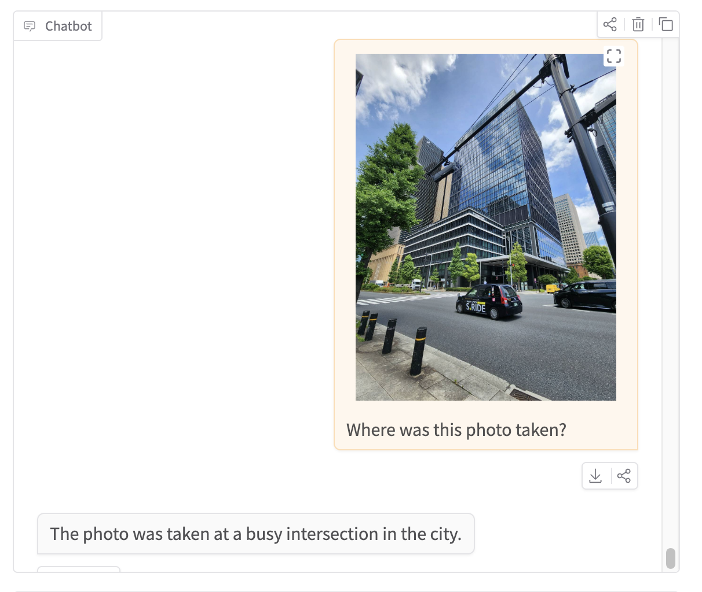
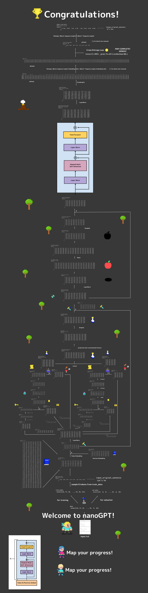

# EveryonesLLM: ColabでChatGPTのようなAIを作ろう！

# [Click-> AI YOU build in Chapter28😘](https://huggingface.co/spaces/HayatoHongoEveryonesAI/EveryonesGPT_SFT)

### 基礎知識（ウォーミングアップ）

一度もMLPやVAEを実装したことがない😥...という方も安心してください！ 
ちょっとたいへんですが、このウォーミングアップをやれば準備万端です。 
すでに実装された経験のある方は、メインから始めてください。

| チャプター  | 推定所要時間 | ノートブック  |
|---|---|---|
| Chapter 01: MNIST MLP 1        | 2〜3時間 |  |
| Chapter 02:  MNIST MLP 2    | 1〜2時間 |  |
| Chapter 03:  cVAE | 2〜3時間 |  |

### EveryonesLLM

### [Webアプリで進めてみよう！](https://EveryonesAI-v2.created.app/)
> メールのみでログインできるようになっています。学習進捗を秘密にしたい場合、他人に自分のメールアドレスを教えないでください。

| チャプター  | 推定所要時間 | ノートブック  |
|---|---|---|
| Chapter 00: Start Tutorial      | 1〜2時間 |  |
| Chapter 01: Dataloader         | 1〜2時間 |  |
| Chapter 02: TokenEmbedding     | 0.5〜1時間 |  |
| Chapter 03: PositionEmbedding  | 0.5〜1時間 |  |
| Chapter 04: EmbeddingModule    | 0.5〜1時間 |  |
| Chapter 05: LayerNorm          | 1〜2時間 |  |
| Chapter 06: AttentionHead      | 3〜4時間 |  |
| Chapter 07: MultiHeadAttention | 1〜2時間 |  |
| Chapter 08: FeedForward        | 1〜2時間 |  |
| Chapter 09: TransformerBlock   | 0.5〜1時間 |  |
| Chapter 10: VocabularyLogits   | 0.5〜1時間 |  |
| Chapter 11: nanoGPT| 1〜2時間 |  |
| Chapter 12: Trainer            | 1〜2時間 |  |
| Chapter 13: Tokens per second(CPU)    | 1~2時間 |  |          |
| Chapter 14: Tokens per second(T4 GPU)     | 0.5〜1時間 |  |          |
| Chapter 15: Train nanoGPT with GPU    | 0.5〜1時間    |  |          |
| Chapter 16: モデルサイズだけ大きくする          | 0.5 ~ 1 時間 (+ モデル学習 1時間)  |  |          |
| Chapter 17:  データセットを大きくする    | 1〜2時間 (+ モデル学習 1時間) |  |          |
| Chapter 18: tiktoken      | 1〜2時間 (+ モデル学習 1時間)   |  |          |
| Chapter 19: Long Train    | 1〜2時間 (+ モデル学習 **6時間** )  |  |          |
| Chapter 20: 学習率            | 0.5〜1時間   |  |          |
| Chapter 21: Scaling Law       | 1〜2時間 |  |          |
| Chapter 22: TinyStories(メイン) | 1〜2時間   |  |          |
| Chapter 22: TinyStories(モデル学習) | 1時間   |  |          |
| Chapter 23: RPE(OverSimplified) | 2~3時間   |  |          |
| Chapter 24: RPE(Simplified)        | 1〜2時間 (+ モデル学習 1時間)      |  |
| Chapter 25: LR schedule      | 1時間      |  |
| Chapter 26: Checkpoint      | 1時間      |  |
| Chapter 27: Pretraining        | 0.5時間 (+ モデル学習 **20時間** )      |  |
| Chapter 28: Instruction Tuning        | 0.5時間 (+ モデル学習 0.5時間 )      |  |
| Chapter 29: Magpie (Prompt mask)        | 1.5時間 (+ モデル学習 2時間 )      |  |

2026/6/5 Vision LLM, ベータ版公開！

解説および問題がありません。また、主要ベンチマークでの性能評価もまだです。

先取り学習用にお使いください。随時更新予定ですので、更新後に取り組むのをお勧めします。

| チャプター  | 推定所要時間 | ノートブック  |
|---|---|---|
| Chapter 30: Vision Pretraining (ベータ版)        |  モデル学習 3時間     |  |
| Chapter 31: Vision Instruction Tuning (ベータ版)       | モデル学習 2時間      |  |

### WebApp -> [Link](https://huggingface.co/spaces/HayatoHongoEveryonesAI/EveryonesGPT_Vision_Instruct_noRoPE)

---

## **Tensor Map（テンソル全体図）**
**下のテンソルマップを自分で作ってみよう！**  
ヒントもたくさん用意しているので安心してください。  
[CanvaでnanoGPTモデルのフル解像度Tensor Mapを見る](https://www.canva.com/design/DAGskS8QP6k/1zs7IklaMrB_LncHn2I8pA/edit?utm_content=DAGskS8QP6k&utm_campaign=designshare&utm_medium=link2&utm_source=sharebutton)

---

## **前提知識・スキル**

**理解してほしいこと**  
- 行列の掛け算と足し算  
- 平均値と分散  
- ResNetの残差接続（residual connection）  
- Word2Vectorの仕組み  

---

## **開発環境について**

セットアップの手間を減らすため、サンプルはGoogle Colab上で動かしてください。進捗管理したい場合はVS Codeをお勧めします。このリポジトリをforkして自分のPCにcloneし、をインストールしてください。

Select Kernel > Colab > New Colab Server > CPU(Chapter13まで) or GPU(Chapter14から) > MyColab(任意で名称記入) > Enterキー 

---

## **解答**

| チャプター                                 | 推定所要時間                   | ノートブック                                                                                                                                                                                                                           |
| ------------------------------------- | ------------------------ | -------------------------------------------------------------------------------------------------------------------------------------------------------------------------------------------------------------------------------- |
| Chapter 00: Start Tutorial      | 1〜2時間 |  |
| Chapter 01: Dataloader         | 1〜2時間 |  |
| Chapter 02: TokenEmbedding     | 0.5〜1時間 |  |
| Chapter 03: PositionEmbedding  | 0.5〜1時間 |  |
| Chapter 04: EmbeddingModule    | 0.5〜1時間 |  |
| Chapter 05: LayerNorm          | 1〜2時間 |  |
| Chapter 06: AttentionHead      | 3〜4時間 |  |
| Chapter 07: MultiHeadAttention | 1〜2時間 |  |
| Chapter 08: FeedForward        | 1〜2時間 |  |
| Chapter 09: TransformerBlock   | 0.5〜1時間 |  |
| Chapter 10: VocabularyLogits   | 0.5〜1時間 |  |
| Chapter 11: nanoGPT| 1〜2時間 |  |
| Chapter 12: Trainer            | 1〜2時間 |  |
| Chapter 13: Tokens per second(CPU)    | 1~2時間                    |        |
| Chapter 14: Tokens per second(T4 GPU) | 0.5〜1時間                  |        |
| Chapter 15: Train nanoGPT with GPU    | 0.5〜1時間                  |        |
| Chapter 16: モデルサイズだけ大きくする             | 0.5 ~ 1 時間 (+ モデル学習 1時間) |        |
| Chapter 17: データセットを大きくする              | 1〜2時間 (+ モデル学習 1時間)      |        |
| Chapter 18: tiktoken                  | 1〜2時間 (+ モデル学習 1時間)      |        |
| Chapter 19: Long Train                | 1〜2時間 (+ モデル学習 **6時間** ) |        |
| Chapter 20: 学習率                       | 0.5〜1時間                  |        |
| Chapter 21: Scaling Law               | 1〜2時間                    |        |
| Chapter 22: TinyStories(メイン)          | 1〜2時間                    |   |
| Chapter 22: TinyStories(モデル学習)        | 1時間                      |  |
| Chapter 23: RPE(OverSimplified)        | 2~3時間                     |  |
| Chapter 24: RPE(Simplified)        | 1〜2時間 (+ モデル学習 1時間)      |  |
| Chapter 25: LR schedule        | 1時間     |  |
| Chapter 26: Checkpoint        | 1時間     |  |
| Chapter 27: Pretraining        | 0.5時間 (+ モデル学習 **20時間** )      |  |
| Chapter 28: Instruction Tuning        | 0.5時間 (+ モデル学習 1時間 )      |  |
| Chapter 29: Magpie (Prompt mask)        | 1.5時間 (+ モデル学習 2時間 )      |  |

## 出典

このチュートリアルは[Andrej KarpathyさんのnanoGPT](https://colab.research.google.com/drive/1JMLa53HDuA-i7ZBmqV7ZnA3c_fvtXnx-?usp=sharing)と[jingyaogongさんのMinimind](https://github.com/jingyaogong/minimind.git)をベースにしています。Instruction Tuningについては Sebastian Raschka さんの著書([Build a Large Language Model (From Scratch)](https://www.manning.com/books/build-a-large-language-model-from-scratch))を参考にしています。Vision LLMについては、[LLaVA](https://github.com/haotian-liu/llava)を参考にしています。
この場を借りて、心から感謝します。

## 注意
本プロジェクトはコミュニティベースのオープンソース教育プロジェクトであり、Google社とは全く関係ありません。

## **Project EveryonesLLMについて**

  
  
  
  
