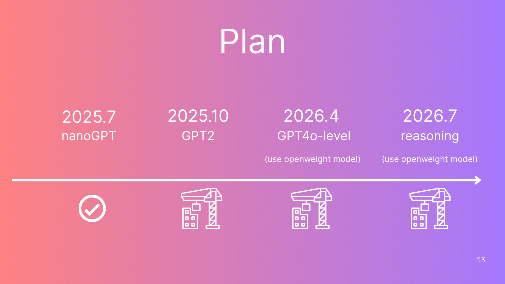

# **Everyones_nanoGPT fill-in-the-blank notebook Tutorial**

```
This is a complete guide for those who love ChatGPT and want to build their own.  
You type "Hello," and it replies, "How can I help you today?"
When you realize this runs on simple math, your heart races. You cannot sleep.   
Welcome to deep learning. There is no way back.  
I created this guide on the train to school, squeezed into a tiny seat on the Tokyo Nanboku Metro.  
Every time I read an excited comment from a student, I feel that those days in that tiny seat had a big meaning.
```

Let's make a nano-GPT model!
This tutorial gives you clear explanations and **over 100 fill-in-the-blank questions**.
If you meet the prerequisites, you can finish in 12–15 hours.
It's the first in the world with this many practice questions—perfect for beginners.
Everything runs in Google Colab. This tutorial is based on [Andrej Karpathy’s nano-GPT](https://colab.research.google.com/drive/1JMLa53HDuA-i7ZBmqV7ZnA3c_fvtXnx-?usp=sharing). I'd like to express my deepest gratitude for his work.


## Table of Contents

| Chapter  | Notebook  |
|---|---|
| Chapter 00: Start Tutorial | [](https://colab.research.google.com/github/HayatoHongo/Everyones_nanoGPT/blob/main/Everyones_nanoGPT_TODO/Everyones_nanoGPT_colab_Chapter00_TODO.ipynb) |
| Chapter 01: Dataloader | [](https://colab.research.google.com/github/HayatoHongo/Everyones_nanoGPT/blob/main/Everyones_nanoGPT_TODO/Everyones_nanoGPT_colab_Chapter01_TODO.ipynb) |
| Chapter 02: TokenEmbedding | [](https://colab.research.google.com/github/HayatoHongo/Everyones_nanoGPT/blob/main/Everyones_nanoGPT_TODO/Everyones_nanoGPT_colab_Chapter02_TODO.ipynb) |
| Chapter 03: PositionEmbedding | [](https://colab.research.google.com/github/HayatoHongo/Everyones_nanoGPT/blob/main/Everyones_nanoGPT_TODO/Everyones_nanoGPT_colab_Chapter03_TODO.ipynb) |
| Chapter 04: EmbeddingModule | [](https://colab.research.google.com/github/HayatoHongo/Everyones_nanoGPT/blob/main/Everyones_nanoGPT_TODO/Everyones_nanoGPT_colab_Chapter04_TODO.ipynb) |
| Chapter 05: LayerNorm | [](https://colab.research.google.com/github/HayatoHongo/Everyones_nanoGPT/blob/main/Everyones_nanoGPT_TODO/Everyones_nanoGPT_colab_Chapter05_TODO.ipynb) |
| Chapter 06: AttentionHead | [](https://colab.research.google.com/github/HayatoHongo/Everyones_nanoGPT/blob/main/Everyones_nanoGPT_TODO/Everyones_nanoGPT_colab_Chapter06_TODO.ipynb) |
| Chapter 07: MultiHeadAttention | [](https://colab.research.google.com/github/HayatoHongo/Everyones_nanoGPT/blob/main/Everyones_nanoGPT_TODO/Everyones_nanoGPT_colab_Chapter07_TODO.ipynb) |
| Chapter 08: FeedForward | [](https://colab.research.google.com/github/HayatoHongo/Everyones_nanoGPT/blob/main/Everyones_nanoGPT_TODO/Everyones_nanoGPT_colab_Chapter08_TODO.ipynb) |
| Chapter 09: TransformerBlock | [](https://colab.research.google.com/github/HayatoHongo/Everyones_nanoGPT/blob/main/Everyones_nanoGPT_TODO/Everyones_nanoGPT_colab_Chapter09_TODO.ipynb) |
| Chapter 10: VocabularyLogits | [](https://colab.research.google.com/github/HayatoHongo/Everyones_nanoGPT/blob/main/Everyones_nanoGPT_TODO/Everyones_nanoGPT_colab_Chapter10_TODO.ipynb) |
| Chapter 11: BigramLanguageModel | [](https://colab.research.google.com/github/HayatoHongo/Everyones_nanoGPT/blob/main/Everyones_nanoGPT_TODO/Everyones_nanoGPT_colab_Chapter11_TODO.ipynb) |
| Chapter 12: Trainer | [](https://colab.research.google.com/github/HayatoHongo/Everyones_nanoGPT/blob/main/Everyones_nanoGPT_TODO/Everyones_nanoGPT_colab_Chapter12_TODO.ipynb) |





## **Prerequisites**

**Understanding**  
- Understand matrix multiplication and addition  
- Understand mean and variance  
- Understand ResNet’s residual connections  
- Understand Word2Vector  
<br>  
<br>  

**Experience**  
- Have built an MNIST digit recognition model using Pytorch’s.
- Have used cross-entropy as a loss function in digit recognition models like the above  
- Have implemented mini-batch processing and batch normalization  
- Have implemented an autoencoder or VAE

We are also working hard to release fun, entry-level tutorials for those who have never used PyTorch or programming by 2025.8.30.

## **Development Environment**

To keep setup simple, try running all examples in Google Colab.

If you want to save your progress—like checkbox marks, which don’t stay saved in Colab—VS Code is a great choice. It’s also handy if you like to work in small bursts, such as 30 minutes at a time. In that case, fork and clone the repo to your own computer.

Python 3.12 and PyTorch 2.6.0 work best, but most versions are fine. Usually, your installed PyTorch will just work. If you hit issues, you can set up a virtual environment using `requirements.txt`. Or, if you use Docker Desktop, you can use the included `Dockerfile` and Dev Container extension for an even more stable setup.


It uses a bigram model, where each token is just one character. Also, the internal structure is very simple.  
The training text dataset is Shakespeare’s writings. Since they are very old, they are copyright-free.

Compared to the real GPT-2, it’s quite basic. But start here to master the GPT basics.  
In just 2-4 minutes of CPU training (on a 16GB memory PC), you can generate Shakespeare-like text. It’s guaranteed to impress!
